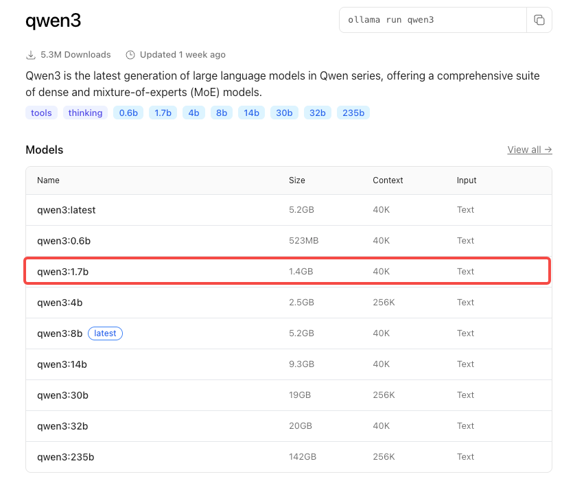

# Tello LLM

本项目使用本地运行的大语言模型（通过Ollama）来解析自然语言指令，并通过 tools 的方式控制一台大疆Tello无人机。同时，项目提供了统一的 tools 功能接口以便未来功能扩展。

该项目在以下硬件环境中通过了测试，更多平台的测试与适配将持续推出：

|Device|Plantform|OS|LLM|
|--|--|--|--|
|Nvidia Orin DK|Arm64|Ubuntu 20.04|Qwen3:1.7b|
|Macbook Air M4|Arm64|MacOS 15.5|Qwen3:1.7b|

这个工程中涉及到的部分资源可以通过下面的网盘链接中获得：

【Note】：当前的代码暂时用不到下面链接的资源，后期添加深度图转换功能时会使用；

```bash
https://pan.baidu.com/s/1tlPzl8ecldkygwWHHuwHhw?pwd=g453
```

---
# 功能与特性

- **自然语言控制**: 使用日常语言（如“向前飞50厘米”）来控制无人机；
- **实时视频流**: 在一个独立的窗口中实时查看无人机的第一视角画面；
- **本地LLM驱动**: 所有语言理解都在本地完成，无需联网，保护隐私，延迟低；
- **工具化设计**: 控制指令被设计成一系列清晰的“工具”，方便LLM理解和调用；
- **安全保障**: 包含紧急停止指令，并在程序退出时自动检查并降落无人机；
- **可扩展功能**: 统一 tool 功能定义接口，方便未来功能扩展；

----
# Step1. 硬件与网络配置

在开始之前你需要确认一下硬件与网络配置：

* 一台能够开机的 Tello 无人机；
* 一台有 Wifi 模块的电脑；
* 电脑能够链接到 Tello 无人机发出的无线网络；
* 电脑的 `192.168.10.X` 网段没有冲突；

----
# Step2. 安装依赖

## 2.1 安装 Ollama

如果你的电脑上已经安装好了 Ollama，那么可以跳过这一步。

* Ollama 下载链接：[https://ollama.com/download](https://ollama.com/download)

这里以 Linux 平台为例，使用下面的命令：
```bash
$ curl -fsSL https://ollama.com/install.sh | sh
```

## 2.2 创建虚拟环境

```bash
$ conda create -n tello python=3.8
$ conda activate tello
$ pip install -r requirements.txt
```

## 2.3 安装依赖库

```bash
$ sudo apt-get install libopenblas-base
```

----
# Step3. 拉取模型

## 3.1 搜索模型
在成功安装 Ollama 之后可以在官网上选择一个合适的语言模型作为 tools 的调用者：

* Ollama 模型搜索网页：[https://ollama.com/](https://ollama.com/)

这里以 `Qwen3:1.7b` 为例，尽管该模型参数量较少，但得益于 tools 的加持，能够很好的平衡控制性能和资源消耗。当然，你也可以从表现角度出发选择参数量更高的模型：



使用下面的命令拉取模型

```bash
$ ollama pull qwen3:1.7b
```

## 3.2 测试token输出速率

由于不同硬件与软件配置，同一个模型可能会在 token 输出速率上存在较大的差异，我们强烈建议在正式开始之前先用我们提供的脚本测试一下模型在你的设备上 token 的输出速率：

* 仅打印测试结果，不打印模型输出内容
```bash
$ condo activate tello
$ python utils/token_test.py qwen3:1.7b
```

* 打印测试结果与模型输出内容：
```bash
$ condo activate tello
$ python utils/token_test.py qwen3:1.7b -v
```

----
# Step4. 配置与启动

## 4.1 配置功能
为了能让你更愉快的使用这个项目，你应该根据自己的需求配置 `config.py` 这个文件：

```python
# 本地模型名
LLM_MODEL = "qwen3:1.7b" 

# Tello无人机的默认等待超时时间（秒）
TELLO_COMMAND_TIMEOUT = 15

# 是否显示实时视频画面。在远程调试或无图形界面的环境下，请设置为 False
SHOW_VIDEO_STREAM = False

# 是否使用真实的Tello无人机。设置为 False 时，将使用模拟器进行调试，
USE_REAL_DRONE = False

# 设置为 True: 所有指令都将发送给LLM进行理解。
# 设置为 False: 程序会先尝试将用户输入作为直接指令（如 "takeoff", "move forward 50"）进行解析。
#              如果解析失败，才会调用LLM。这可以为简单指令节省时间。
ALWAYS_USE_LLM = False
```

## 4.2 启动脚本

按照下面的顺序启动脚本：

1. **开启Tello无人机**，等待指示灯变为黄色闪烁状态。
2. **连接无人机的Wi-Fi**: 在你的电脑上，搜索Wi-Fi网络，连接到名为 `TELLO-XXXXX` 的网络。
3. **运行主程序**: 在你的项目文件夹中，打开终端并运行：

```bash
$ condo activate tello
$ python main.py
```

### 直接指令模型
在脚本正常启动之后根据提示信息可以对无人机进行控制，直接在终端输入你想告诉模型的内容，等待模型推理完成后会自动调用对应的工具。

### 混合指令模式
得益于工程优化，你可以直接在终端输入 `llm_tools.py` 文件中 `tools_definitions` 定义的工具，例如 `takeoff` 命令会直接让无人机起飞，而不会传递给语言模型，从而降低无人机的响应时间。


----
# 扩展 tool 功能

【测试中】